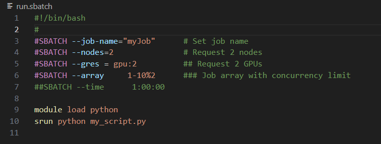

# Slurm Syntax Highlighting for VS Code

Precise syntax highlighting for Slurm job scripts in Visual Studio Code. 

👌Enhance your HPC workflow

## ✨ Features

- Full syntax highlighting for `#SBATCH` directives
- Parameter name, assignment operator, and value are individually styled
- Inline comments supported (e.g. `#SBATCH --ntasks=4  # allocate 4 tasks`)
- Shell syntax also combined (`echo`, `module`, `srun`, etc.)

## 📁 Supported File Types

This extension automatically activates when editing files with the following extensions:

- `.sbatch`
- `.slurm`
- `.sjob`
- `.job`

If your VS Code does not automatically associate these files with the extension, you can manually set the language mode to `sbatch` using the language selector in the bottom-right corner of the editor.

💡 Tip: You can also add these extensions to your `files.associations` in `settings.json` for persistent language binding:

```json
"files.associations": {
  "*.sbatch": "sbatch",
  "*.slurm": "sbatch",
  "*.sjob": "sbatch",
  "*.job": "sbatch"
}
```


## 📦 Supported Syntax

```bash
#!/bin/bash
#
#SBATCH --job-name="myJob"      # Set job name
#SBATCH --nodes=2               # Request 2 nodes
#SBATCH --gres = gpu:2          ## Request 2 GPUs
#SBATCH --array     1-10%2      ### Job array with concurrency limit
##SBATCH --time      1:00:00

module load python
srun python my_script.py
```

demo:

## 📄 License

This project is licensed under the MIT License - see the [LICENSE](./LICENSE) file for details.

## 🙏 Acknowledgements

This extension was developed with the assistance of [Microsoft Copilot](https://copilot.microsoft.com) and [Github Copilot](https://github.com/copilot)
